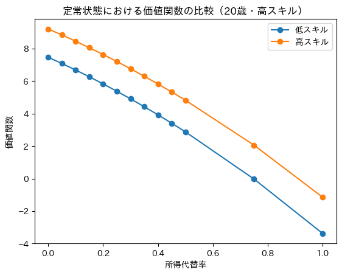
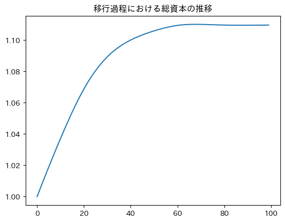
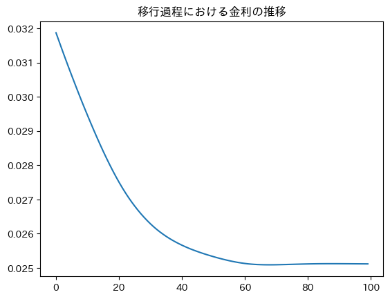
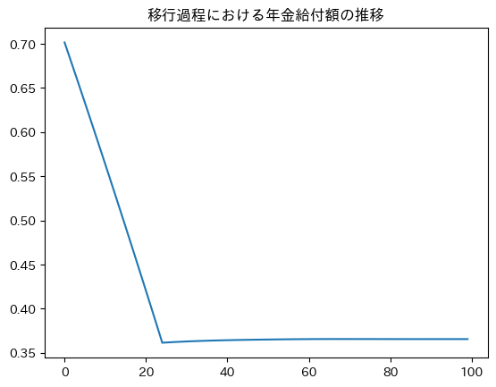
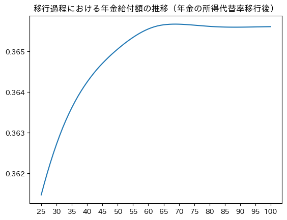
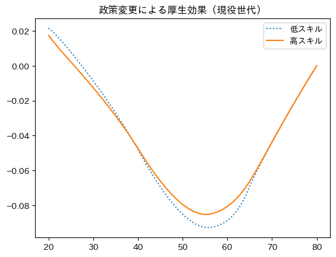
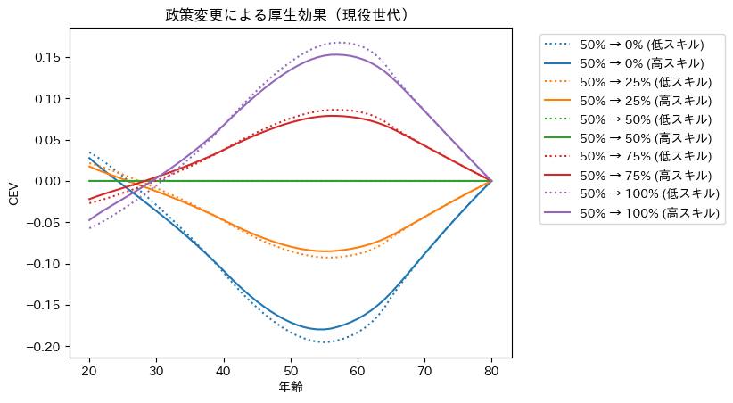
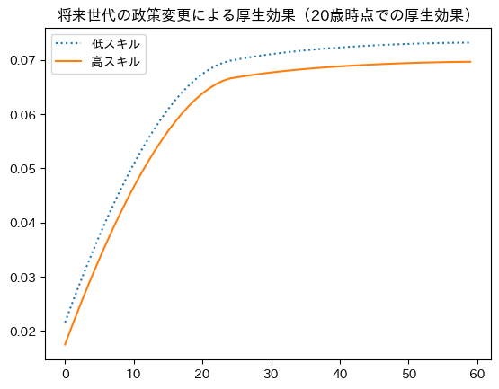
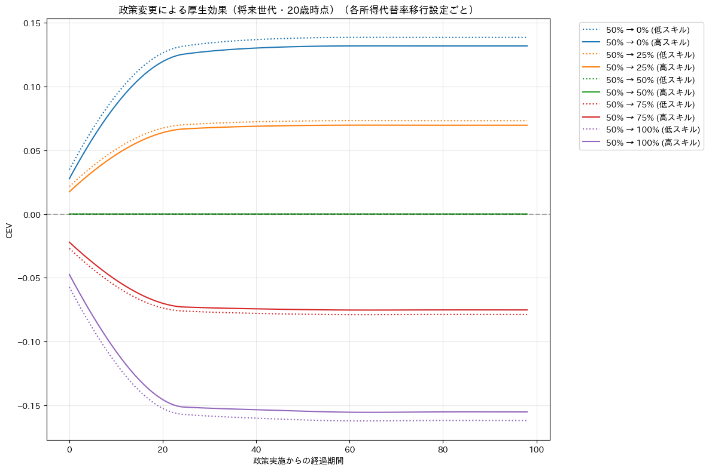

# Overlapping Generation Model (replicated from Kitao, Sunakawa and Yamada（2024）)

This repository contains the code for the Overlapping Generation Model as explained in the book "定量マクロ経済学と数値計算" written by Kitao, Sunakawa and Yamada（2024）.

## Results

### Steady State

**Value Function by Replacement Rate (age 20, high/low skill)**



---

### Transition Path

**Aggregate Capital**



**Interest Rate**



**Pension Benefits**





---

### Welfare Effects (CEV)

**Current Generation — by age at time of policy change**





**Future Generations — CEV at age 20 by cohort**





## Structure

Main logic is implemented in `olg` folder that is structured as Python package. The directory structure is as follows:

```
olg
├── __init__.py
├── cev # functions and classes for calculating consumption equivalent variation
│   ├── __init__.py
│   ├── cev_analysis.py
│   ├── cev_calculator.py
│   └── cev_plotter.py
├── ss # functions and classes for calculating steady state
│   ├── __init__.py
│   ├── asset_supply.py
│   ├── distribution_updater.py
│   ├── household_solver.py
│   ├── plot_asset_path.py
│   ├── setting.py
│   ├── solve_ss.py
│   ├── steady_state_result.py
│   └── utils.py
└── transition # functions and classes for calculating transition path
    ├── __init__.py
    ├── backward.py
    ├── capital_guess.py
    ├── forward.py
    ├── main.py
    ├── market_clearing.py
    ├── setting.py
    └── transition_solver.py
```

## Development Environment

The code is developed and tested in a Docker containerized environment using VSCode DevContainers.

### Setup

1. **Prerequisites**
   - Docker and Docker Compose
   - VSCode with Dev Containers extension

2. **Development Setup**
   ```bash
   # Clone the repository
   git clone <repository-url>
   cd olg

   # Open in VSCode DevContainer
   code .
   # Then: Ctrl/Cmd + Shift + P → "Dev Containers: Reopen in Container"
   ```

3. **Manual Docker Usage**
   ```bash
   # Start the container
   docker-compose up -d

   # Execute Python scripts
   docker-compose exec olg-dev python main.py

   # Access shell
   docker-compose exec olg-dev bash
   ```

### Code Quality Tools

- **Linting & Formatting**: ruff (configured in `pyproject.toml`)
- **Auto-formatting**: Enabled on save in DevContainer
- **Manual formatting**: `ruff format .`
- **Manual linting**: `ruff check .`
